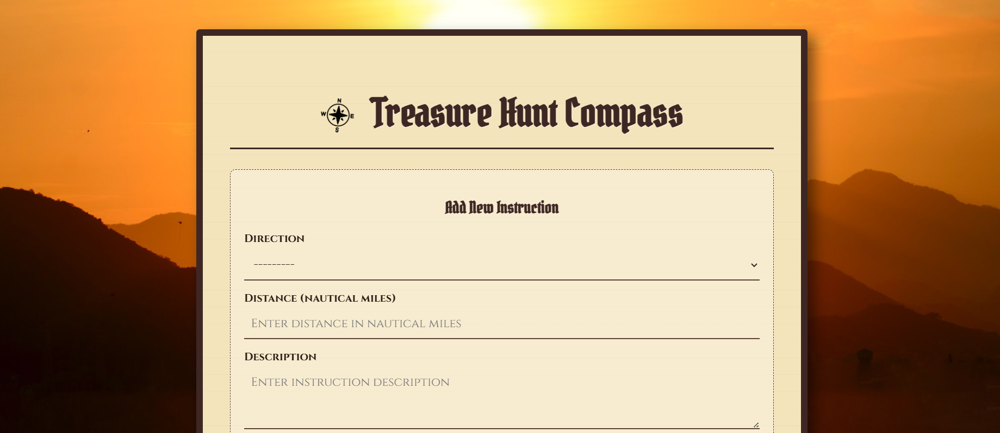

# 🏴‍☠️ The Captain's Compass

A Django-based navigational tool for modern pirates. This application allows captains to chart courses, track nautical miles, and calculate the risk factor of their journey to the treasure.


## 🗺️ About The Project

Modern problems require modern solutions. This app helps pirates move away from soggy paper maps to a digital instruction database. It features a thematic "Old World" parchment interface with CSS animations, while running on a robust Django backend.

### Key Features

* 🧭 Instruction Tracking: Add directional steps (North, South-East, etc.) with distances in nautical miles.

* 🔗 Linked Routes: Logic to link current instructions to previous ones, creating a cohesive path.

* ⚠ Risk Analysis: Algorithm to calculate the Total Distance and Average Risk Level from any given point to the end of the route.

* 🎨 Immersive UI: Custom CSS/JS styling featuring:

    * Unfurling parchment animations.

    * Wobbling compass interactions.

    * Handwriting-style fonts and inputs.

    * Cascading list animations.

## 🛠️ Built With

* **Backend**: Django (Python)
* **Frontend**: HTML5, CSS, JS
* **Database**: SQLite (Default)

## ⚓ Getting Started

To get a local copy up and running, follow these simple steps.

### Prerequisites
* Python 3.8+ installed

* Pip (Python package manager)

### Installation
1. **Clone the Repository**
```bash
git clone https://github.com/yourusername/treasure-hunt.git
cd treasure-hunt
```

2. **Create and activate a virtual environment**
```bash
# Windows
python -m venv venv
venv\Scripts\activate

# Mac/Linux
python3 -m venv venv
source venv/bin/activate
```

3. **Install dependencies**
```bash
pip install -r requirements.txt
```


4. **Apply Database Migrations**
```bash
python manage.py makemigrations
python manage.py migrate
```

5. **Run the Server**
```bash
python manage.py runserver
```
6. **Set Sail!!!**
Open your browser and navigate to: ```http://127.0.0.1:8000/compass/```


## 📂 Project Structure

```text
django_th/
├── compass/                # The Main App (Treasure Hunt Logic)
│   ├── forms.py            # Input forms & validation
│   ├── models.py           # Database models (Instructions, Risk)
│   ├── urls.py             # App-specific URL routes
│   └── views.py            # View logic & calculations
├── django_th/              # Project Configuration
│   ├── settings.py         # Global settings (Apps, Database, Static)
│   └── urls.py             # Main project URL entry point
├── static/                 # Static Assets (CSS, JS, Images)
│   ├── css/                # Styles (compass.css)
│   ├── images/             # Backgrounds & Icons
│   └── js/                 # Animations (main.js)
├── templates/              # HTML Templates
│   └── compass/            # Compass & Detail pages
├── db.sqlite3              # SQLite Database
├── manage.py               # Django command-line utility
└── requirements.txt        # Project dependencies
```

## 📸 Screen Grabs

**The Compass Form (Parchment Style)**


**Route Details & Risk Calculation**
